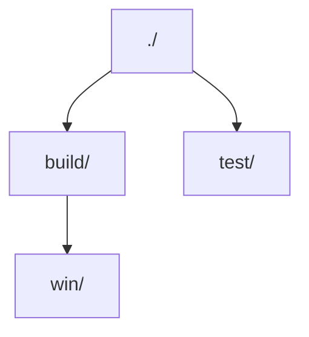

# 🌳❌ Treex

[](https://golang.org)
[](LICENSE)
[](https://github.com/shiquda/treex/releases)
[](https://goreportcard.com/report/github.com/shiquda/treex)


[简体中文](/docs/README_zh-cn.md)

Treex is a powerful command-line tool for displaying directory structures in different formats. It offers **multiple output formats** and **flexible filtering options**, making it easy to visualize and explore your project layout.

## ✨ Features

- 🎨 Multiple output formats:
  - 🌲 `tree`: Tree format (default)
  - 📑 `indent`: Indented list format
  - 📝 `md`: Markdown format
  - 📊 `mermaid`: Mermaid format
- 🔍 Flexible filtering options:
  - 🕵️ `-H`: Hide hidden files and directories
  - 📁 `-D`: Show directories only
  - 🚫 `-e <rules>`: Exclude specific directories or file extensions
  - 📝 `-I`: Automatically apply .gitignore rules
- 🛠️ Customizable output:
  - 📏 `-m <depth>`: Control directory depth
  - 💾 `-o <path>`: Save output to a file
  - 🎯 `-f <format>`: Select output format
  - ⭐ `-C`: Show icons for files (via emoji)

## 📦 Installation

Download the pre-built binary from the [releases](https://github.com/shiquda/treex/releases) page and add it to your PATH.

Or, if you want to build it yourself with Go:

```bash
go install github.com/shiquda/treex@latest
```

## 📖 Usage

Basic usage:

```bash
treex -d <directory>
```

To generate a tree for the current directory, simply run:

```bash
treex
```

### ⚙️ Full Options

You can run `treex -h` to see the help message.

All command-line options are listed in the table below:

| Short Option | Long Option    | Argument            | Description                                                                 | Default Value |
|--------------|----------------|---------------------|-----------------------------------------------------------------------------|---------------|
| `-d`         | `--dir`        | `<directory>`       | Directory to scan                                                           | `.`           |
| `-f`         | `--format`     | `<format>`          | Output format (`tree`, `indent`, `md`, `mermaid`)                           | `tree`        |
| `-m`         | `--max-depth`  | `<number>`          | Maximum directory depth (0 for unlimited)                                  | -             |
| `-o`         | `--output`     | `<filepath>`        | Path to output file                                                         | stdout        |
| `-e`         | `--exclude`    | `<rules>`           | Exclude rules (comma-separated: `dir/` for dirs, `.ext` for extensions)     | -             |
| `-H`         | `--hide-hidden` | -                   | Hide hidden files and directories                                           | false         |
| `-D`         | `--dirs-only`  | -                   | Show directories only                                                       | false         |
| `-I`         | `--use-gitignore` | -                 | Exclude files/directories based on `.gitignore`                              | false         |
| `-C`         | `--icons`      | -                   | Show file type icons                                                        | false         |

Format options details:

- `tree`: Tree structure with branches
- `indent`: Indented list format
- `md`: Markdown format
- `mermaid`: Mermaid format for diagrams

Exclude rules format:

- `dir/`: Exclude directories matching the specified name
- `.ext`: Exclude files with the specified extension

## 📚 Examples

The following examples use the same directory structure.

1. Without hidden files, save output as markdown format:

```bash
treex -H -f md -o structure.md
```

- `-H`: Hide hidden files and directories
- `-f md`: Output in Markdown format
- `-o structure.md`: Save output to structure.md file

<details>

<summary>Result:</summary>

Then in `./structure.md`:

```markdown
- ./
  - 1.go
  - 2.go
  - README.md
  - build/
    - win/
      - output.exe
  - test/
    - 3.go
    - README_test.md
```

</details>

2. Use .gitignore rules to exclude files:

`.gitignore`:

```text
build/
```

Run:

```bash
treex -IH
```

- `-I`: Exclude files/directories based on `.gitignore`
- `-H`: Hide hidden files and directories

This will automatically read the `.gitignore` file in the current directory and exclude matching files and directories.

<details>

<summary>Result:</summary>

```text
.
├── 1.go
├── 2.go
├── README.md
└── test
    ├── 3.go
    └── README_test.md
```

</details>

3. Generate mermaid diagram for visible directories only:

```bash
treex -HD -f mermaid
```

- `-H`: Hide hidden files and directories
- `-D`: Show directories only
- `-f mermaid`: Output in Mermaid diagram format

<details>

<summary>Result:</summary>



</details>

4. Exclude specific directories or extensions:

```bash
treex -e ".git/, .md"
```

- `-e ".git/, .md"`: Exclude `.git` directory and files with `.md` extension

<details>

<summary>Result:</summary>

```text
.
├── .gitignore
├── 1.go
├── 2.go
├── build
│   └── win
│       └── output.exe
└── test
    └── 3.go
```

</details>

5. Show files up to depth 2 in indent mode:

```bash
treex -m 2 -f indent
```

- `-m 2`: Show files up to depth 2
- `-f indent`: Output in indented list format

<details>

<summary>Result:</summary>

```text
./
    .git/
        HEAD
        config
        description
        hooks/
        info/
        objects/
        refs/
    .gitignore
    1.go
    2.go
    README.md
    build/
        win/
    test/
        3.go
        README_test.md
```

</details>

6. Display the file structure with icons (using a real project structure as an example):

```bash
treex -CHI -m 3
```

- `-C`: Show file type icons
- `-H`: Hide hidden files and directories
- `-I`: Exclude files/directories based on `.gitignore`
- `-m 3`: Show files up to depth 3

<details>

<summary>Result:</summary>

```text
📁 ./
├── 📝 CODE_OF_CONDUCT.md
├── 📝 CONTRIBUTING.md
├── 📄 LICENSE
├── 📝 README.md
├── 📁 build/
│   ├── 📄 entitlements.mac.plist
│   ├── 📄 icon.icns
│   ├── 📄 icon.ico
│   ├── 🖼️ icon.png
│   ├── 📁 icons/
│   │   ├── 🖼️ 1024x1024.png
│   │   ├── 🖼️ 128x128.png
│   │   ├── 🖼️ 16x16.png
│   │   ├── 🖼️ 24x24.png
│   │   ├── 🖼️ 256x256.png
│   │   ├── 🖼️ 32x32.png
│   │   ├── 🖼️ 48x48.png
│   │   ├── 🖼️ 512x512.png
│   │   └── 🖼️ 64x64.png
│   ├── 🖼️ logo.png
│   ├── 📄 nsis-installer.nsh
│   ├── 🖼️ tray_icon.png
│   ├── 🖼️ tray_icon_dark.png
│   └── 🖼️ tray_icon_light.png
├── ⚙️ dev-app-update.yml
├── 📁 docs/
│   ├── 📝 README.ja.md
│   ├── 📝 README.zh.md
│   ├── 📝 dev.md
│   ├── 📝 sponsor.md
│   └── 📁 technical/
│       └── 📝 KnowledgeService.md
├── ⚙️ electron-builder.yml
├── 📜 electron.vite.config.ts
├── 📄 eslint.config.mjs
├── 📋 package.json
├── 📁 packages/
│   ├── 📁 artifacts/
│   │   ├── 📝 README.md
│   │   ├── 📋 package.json
│   │   └── 📁 statics/
│   ├── 📁 database/
│   │   ├── 📝 README.md
│   │   ├── 📁 data/
│   │   ├── 📋 package.json
│   │   ├── 📁 src/
│   │   └── 📄 yarn.lock
│   └── 📁 shared/
│       ├── 📜 IpcChannel.ts
│       └── 📁 config/
├── 📁 resources/
│   ├── 📁 cherry-studio/
│   │   ├── 🌐 license.html
│   │   └── 🌐 releases.html
│   ├── 📁 data/
│   │   └── 📋 agents.json
│   ├── 📁 js/
│   │   ├── 📜 bridge.js
│   │   └── 📜 utils.js
│   ├── 📁 scripts/
│   │   ├── 📜 download.js
│   │   ├── 📜 install-bun.js
│   │   └── 📜 install-uv.js
│   └── 📄 textMonitor.swift
├── 📁 scripts/
│   ├── 📜 after-pack.js
│   ├── 📜 build-npm.js
│   ├── 📜 check-i18n.js
│   ├── 📜 check-i18n.ts
│   ├── 📜 cloudflare-worker.js
│   ├── 📜 notarize.js
│   ├── 📜 remove-locales.js
│   ├── 📜 replace-spaces.js
│   ├── 📜 update-i18n.ts
│   ├── 📜 utils.js
│   └── 📜 version.js
├── 📁 src/
│   ├── 📁 components/
│   ├── 📁 main/
│   │   ├── 📜 config.ts
│   │   ├── 📜 constant.ts
│   │   ├── 📜 electron.d.ts
│   │   ├── 📁 embeddings/
│   │   ├── 📜 env.d.ts
│   │   ├── 📜 index.ts
│   │   ├── 📁 integration/
│   │   ├── 📜 ipc.ts
│   │   ├── 📁 loader/
│   │   ├── 📁 mcpServers/
│   │   ├── 📁 reranker/
│   │   ├── 📁 services/
│   │   └── 📁 utils/
│   ├── 📁 preload/
│   │   ├── 📜 index.d.ts
│   │   └── 📜 index.ts
│   └── 📁 renderer/
│       ├── 🌐 index.html
│       └── 📁 src/
├── 📋 tsconfig.json
├── 📋 tsconfig.node.json
├── 📋 tsconfig.web.json
└── 📄 yarn.lock
```

</details>

## ♥️ Contribution

The project is in its early stages of development. All contributions are welcome, including raising issues, submitting pull requests, or giving the project a ⭐ star on GitHub!
