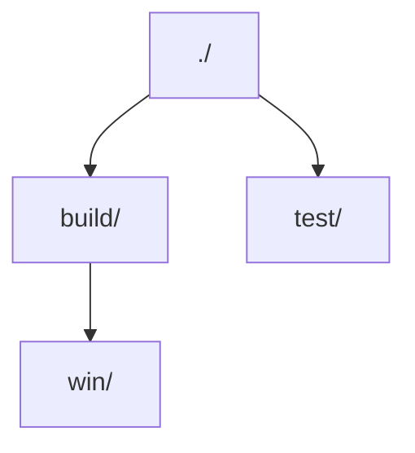

# 🌳❌ Treex

Treex is a powerful command-line tool for displaying directory structures in various formats. It provides multiple output formats and flexible filtering options to help you visualize your project structure.

## ✨ Features

- 🎨 Multiple output formats:
  - 🌲 Tree format (default)
  - 📑 Indent format
  - 📝 Markdown format
  - 📊 Mermaid format
- 🔍 Flexible filtering options:
  - 🕵️ Hide hidden files and directories
  - 📁 Show directories only
  - 🚫 Exclude specific directories or file types
  - 📝 Automatically use .gitignore rules
- 🛠️ Customizable output:
  - 📏 Control directory depth
  - 💾 Save output to file
  - 🎯 Customize output format

## 📦 Installation

Download the pre-build binary from the [releases](https://github.com/shiquda/treex/releases), and add it to your PATH.

Or, if you want to build it yourself with go:

```bash
go install github.com/shiquda/treex@latest
```

## 📖 Usage

Basic usage:

```bash
treex -d <directory>
```

To generate a tree for the current directory, you just need to run:

```bash
treex
```

### ⚙️ Options

You can run `treex -h` to see the help document.

- `-d, --dir`: Directory to scan (default: ".")
- `-f, --format`: Output format (default: "tree")
  - `tree`: Tree format with lines
  - `indent`: Indent format
  - `md`: Markdown format
  - `mermaid`: Mermaid format for diagrams
- `-m, --max-depth`: Maximum directory depth (0 for unlimited)
- `-o, --output`: Output file path (default: stdout)
- `-e, --exclude`: Exclude rules (comma-separated)
  - `dir/`: Exclude directories with specific names
  - `.ext`: Exclude files with specific extensions
- `-H, --hide-hidden`: Hide hidden files and directories
- `-D, --dirs-only`: Show directories only
- `-I, --use-gitignore`: Use .gitignore mode to exclude files/directories

## 📚 Examples

We use the same directory for illustration:

0. Simply run `treex`

```text
.
├── .git
│   ├── HEAD
│   ├── config
│   ├── description
│   ├── hooks
│   │   ├── applypatch-msg.sample
│   │   ├── commit-msg.sample
│   │   ├── fsmonitor-watchman.sample
│   │   ├── post-update.sample
│   │   ├── pre-applypatch.sample
│   │   ├── pre-commit.sample
│   │   ├── pre-merge-commit.sample
│   │   ├── pre-push.sample
│   │   ├── pre-rebase.sample
│   │   ├── pre-receive.sample
│   │   ├── prepare-commit-msg.sample
│   │   ├── push-to-checkout.sample
│   │   ├── sendemail-validate.sample
│   │   └── update.sample
│   ├── info
│   │   └── exclude
│   ├── objects
│   │   ├── info
│   │   └── pack
│   └── refs
│       ├── heads
│       └── tags
├── .gitignore
├── 1.go
├── 2.go
├── README.md
├── build
│   └── win
│       └── output.exe
└── test
    ├── 3.go
    └── README_test.md
```

1. Without hidden files, save output as markdown format:

```bash
treex -H -f md -o structure.md
```

Then in `./structure.md`:

```markdown
- ./
  - 1.go
  - 2.go
  - README.md
  - build/
    - win/
      - output.exe
  - test/
    - 3.go
    - README_test.md
```

2. Use .gitignore rules to exclude files:

`.gitignore`:

```text
build/
```

```bash
treex -IH
```

This will automatically read the `.gitignore` file in the current directory and use the rules to exclude files and directories.

```text
.
├── 1.go
├── 2.go
├── README.md
└── test
    ├── 3.go
    └── README_test.md
```

3. Generate mermaid diagram for unhidden directories only:

```bash
treex -HD -f mermaid
```



4. Exclude specific directories or file types:

```bash
treex -e ".git/, .md"
```

```text
.
├── .gitignore
├── 1.go
├── 2.go
├── build
│   └── win
│       └── output.exe
└── test
    └── 3.go
```

5. Show files up to depth 2 in indent mode:

```bash
treex -m 3 -f indent
```

```text
.
    .git
        HEAD
        config
        description
    .gitignore
    1.go
    2.go
    README.md
    build
    test
        3.go
        README_test.md
```

## ♥️ Contribution

The project is in its early stages of development. Any form of assistance is welcome, including raising issues, creating PRs, or giving it a STAR⭐!
