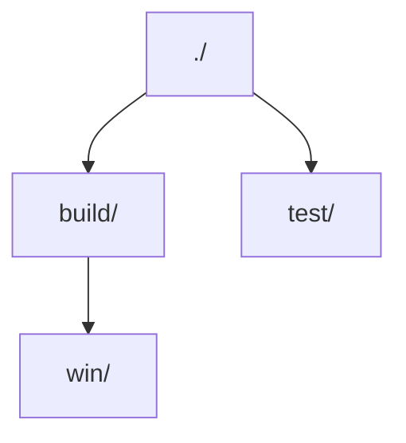

# 🌳❌ Treex

[](https://golang.org)
[](LICENSE)
[](https://github.com/shiquda/treex/releases)
[](https://goreportcard.com/report/github.com/shiquda/treex)


[English](/README.md)

Treex 是一款强大的命令行工具，能够以多种格式展示目录结构。它提供**多种输出格式**和**灵活的过滤选项**，帮助您直观查看项目结构。

## ✨ 功能特性

- 🎨 多格式输出：
  - 🌲 `tree`: 树状格式（默认）
  - 📑 `indent`: 缩进列表格式
  - 📝 `md`: Markdown格式
  - 📊 `mermaid`: Mermaid流程图格式
- 🔍 灵活过滤：
  - 🕵️ `-H`: 隐藏系统文件和目录
  - 📁 `-D`: 仅显示目录
  - 🚫 `-e <rules>`: 排除特定目录或文件扩展名
  - 📝 `-I`: 自动应用.gitignore规则
- 🛠️ 自定义输出：
  - 📏 `-m <depth>`: 控制目录深度
  - 💾 `-o <path>`: 保存输出到文件
  - 🎯 `-f <format>`: 选择输出格式
  - ⭐ `-C`: 显示文件类型图标（通过emoji）

## 📦 安装方法

从[发布页面](https://github.com/shiquda/treex/releases)下载预编译二进制文件，并添加到PATH环境变量。

或使用Go自行编译：

```bash
go install github.com/shiquda/treex@latest
```

如果你是Windows用户，可以使用[scoop](https://scoop.sh/scoop)安装treex：

```bash
scoop bucket add extras
scoop install treex
```

## 📖 使用指南

基础用法：

```bash
treex -d <目录路径>
```

生成当前目录树：

```bash
treex
```

### ⚙️ 参数选项

执行 `treex -h` 查看帮助文档。

命令行参数对照表：

| 短参数 | 长参数        | 参数值            | 描述                                                                 | 默认值       |
|--------|---------------|-------------------|---------------------------------------------------------------------|-------------|
| `-d`   | `--dir`       | `<目录>`          | 要扫描的目录                                                         | `.`         |
| `-f`   | `--format`    | `<格式>`          | 输出格式（`tree`/`indent`/`md`/`mermaid`）                           | `tree`      |
| `-m`   | `--max-depth` | `<数字>`          | 最大目录深度（0表示无限制）                                         | -           |
| `-o`   | `--output`    | `<文件路径>`      | 输出文件路径                                                        | stdout      |
| `-e`   | `--exclude`   | `<规则>`          | 排除规则（逗号分隔：`dir/`排除目录，`.ext`排除扩展名）               | -           |
| `-H`   | `--hide-hidden` | -               | 隐藏系统文件和目录                                                   | false       |
| `-D`   | `--dirs-only` | -               | 仅显示目录                                                          | false       |
| `-I`   | `--use-gitignore` | -             | 根据`.gitignore`排除文件和目录                                       | false       |
| `-C`   | `--icons`     | -               | 显示文件类型图标                                                    | false       |

格式说明：

- `tree`：带连接线的树状结构
- `indent`：缩进列表格式
- `md`：Markdown格式
- `mermaid`：Mermaid流程图格式

排除规则格式：

- `dir/`：排除指定名称的目录
- `.ext`：排除指定扩展名的文件

## 📚 使用示例

以下示例使用相同的目录结构。

1. 排除隐藏文件并保存为Markdown格式：

```bash
treex -H -f md -o structure.md
```

- `-H`: 隐藏系统文件和目录
- `-f md`: 以Markdown格式输出
- `-o structure.md`: 将输出保存到structure.md文件

<details>
<summary>生成文件内容：</summary>

```markdown
- ./
  - 1.go
  - 2.go
  - README.md
  - build/
    - win/
      - output.exe
  - test/
    - 3.go
    - README_test.md
```

</details>

2. 使用`.gitignore`规则排除文件：

`.gitignore`内容：

```text
build/
```

执行命令：

```bash
treex -IH
```

- `-I`: 根据`.gitignore`规则排除文件和目录
- `-H`: 隐藏系统文件和目录

这将自动读取当前目录中的`.gitignore`文件并排除匹配的文件和目录。

<details>
<summary>输出结果：</summary>

```text
.
├── 1.go
├── 2.go
├── README.md
└── test
    ├── 3.go
    └── README_test.md
```

</details>

3. 生成仅显示可见目录的Mermaid流程图：

```bash
treex -HD -f mermaid
```

- `-H`: 隐藏系统文件和目录
- `-D`: 仅显示目录
- `-f mermaid`: 以Mermaid流程图格式输出

<details>
<summary>输出结果：</summary>



</details>

4. 排除特定目录或文件扩展名：

```bash
treex -e ".git/, .md"
```

- `-e ".git/, .md"`: 排除`.git`目录和`.md`扩展名的文件

<details>
<summary>输出结果：</summary>

```text
.
├── .gitignore
├── 1.go
├── 2.go
├── build
│   └── win
│       └── output.exe
└── test
    └── 3.go
```

</details>

5. 以缩进格式显示深度为2的文件：

```bash
treex -m 2 -f indent
```

- `-m 2`: 显示深度为2的文件
- `-f indent`: 以缩进格式输出

<details>
<summary>输出结果：</summary>

```text
./
    .git/
        HEAD
        config
        description
        hooks/
        info/
        objects/
        refs/
    .gitignore
    1.go
    2.go
    README.md
    build/
        win/
    test/
        3.go
        README_test.md
```

</details>

6. 显示带图标的文件结构（使用实际项目结构作为示例）：

```bash
treex -CHI -m 3
```

- `-C`: 显示文件类型图标
- `-H`: 隐藏系统文件和目录
- `-I`: 根据`.gitignore`规则排除文件和目录
- `-m 3`: 显示深度为3的文件

<details>
<summary>输出结果：</summary>

```text
📁 ./
├── 📝 CODE_OF_CONDUCT.md
├── 📝 CONTRIBUTING.md
├── 📄 LICENSE
├── 📝 README.md
├── 📁 build/
│   ├── 📄 entitlements.mac.plist
│   ├── 📄 icon.icns
│   ├── 📄 icon.ico
│   ├── 🖼️ icon.png
│   ├── 📁 icons/
│   │   ├── 🖼️ 1024x1024.png
│   │   ├── 🖼️ 128x128.png
│   │   ├── 🖼️ 16x16.png
│   │   ├── 🖼️ 24x24.png
│   │   ├── 🖼️ 256x256.png
│   │   ├── 🖼️ 32x32.png
│   │   ├── 🖼️ 48x48.png
│   │   ├── 🖼️ 512x512.png
│   │   └── 🖼️ 64x64.png
│   ├── 🖼️ logo.png
│   ├── 📄 nsis-installer.nsh
│   ├── 🖼️ tray_icon.png
│   ├── 🖼️ tray_icon_dark.png
│   └── 🖼️ tray_icon_light.png
├── ⚙️ dev-app-update.yml
├── 📁 docs/
│   ├── 📝 README.ja.md
│   ├── 📝 README.zh.md
│   ├── 📝 dev.md
│   ├── 📝 sponsor.md
│   └── 📁 technical/
│       └── 📝 KnowledgeService.md
├── ⚙️ electron-builder.yml
├── 📜 electron.vite.config.ts
├── 📄 eslint.config.mjs
├── 📋 package.json
├── 📁 packages/
│   ├── 📁 artifacts/
│   │   ├── 📝 README.md
│   │   ├── 📋 package.json
│   │   └── 📁 statics/
│   ├── 📁 database/
│   │   ├── 📝 README.md
│   │   ├── 📁 data/
│   │   ├── 📋 package.json
│   │   ├── 📁 src/
│   │   └── 📄 yarn.lock
│   └── 📁 shared/
│       ├── 📜 IpcChannel.ts
│       └── 📁 config/
├── 📁 resources/
│   ├── 📁 cherry-studio/
│   │   ├── 🌐 license.html
│   │   └── 🌐 releases.html
│   ├── 📁 data/
│   │   └── 📋 agents.json
│   ├── 📁 js/
│   │   ├── 📜 bridge.js
│   │   └── 📜 utils.js
│   ├── 📁 scripts/
│   │   ├── 📜 download.js
│   │   ├── 📜 install-bun.js
│   │   └── 📜 install-uv.js
│   └── 📄 textMonitor.swift
├── 📁 scripts/
│   ├── 📜 after-pack.js
│   ├── 📜 build-npm.js
│   ├── 📜 check-i18n.js
│   ├── 📜 check-i18n.ts
│   ├── 📜 cloudflare-worker.js
│   ├── 📜 notarize.js
│   ├── 📜 remove-locales.js
│   ├── 📜 replace-spaces.js
│   ├── 📜 update-i18n.ts
│   ├── 📜 utils.js
│   └── 📜 version.js
├── 📁 src/
│   ├── 📁 components/
│   ├── 📁 main/
│   │   ├── 📜 config.ts
│   │   ├── 📜 constant.ts
│   │   ├── 📜 electron.d.ts
│   │   ├── 📁 embeddings/
│   │   ├── 📜 env.d.ts
│   │   ├── 📜 index.ts
│   │   ├── 📁 integration/
│   │   ├── 📜 ipc.ts
│   │   ├── 📁 loader/
│   │   ├── 📁 mcpServers/
│   │   ├── 📁 reranker/
│   │   ├── 📁 services/
│   │   └── 📁 utils/
│   ├── 📁 preload/
│   │   ├── 📜 index.d.ts
│   │   └── 📜 index.ts
│   └── 📁 renderer/
│       ├── 🌐 index.html
│       └── 📁 src/
├── 📋 tsconfig.json
├── 📋 tsconfig.node.json
├── 📋 tsconfig.web.json
└── 📄 yarn.lock
```

</details>

## ♥️ 参与贡献

Treex 还处于早期开发阶段。欢迎任何形式的参与，包括提交Issue、发起PR，或在赏本项目一个⭐星星~！

## ⭐ Star History

<a href="https://www.star-history.com/#shiquda/treex&Timeline">
 <picture>
   <source media="(prefers-color-scheme: dark)" srcset="https://api.star-history.com/svg?repos=shiquda/treex&type=Timeline&theme=dark" />
   <source media="(prefers-color-scheme: light)" srcset="https://api.star-history.com/svg?repos=shiquda/treex&type=Timeline" />
   
 </picture>
</a>
